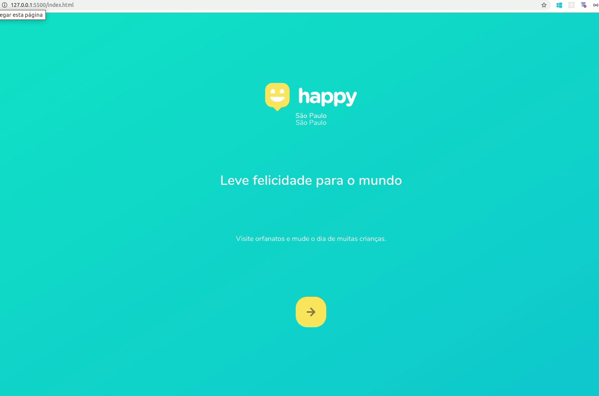

<h1 align="center">
  
</h1>

<h1 align="center">
  
</h1>

## 📝 Description

Happy is an app based on the **Next Week Level 3 (NLW#3)** workshop featured by **Rocketseat School**,m which is a special week where we build a web app from zero. The aim of this app, inspired in the Children's Week, is to connect communities with **Non-Governmental Organizations (NGO's)** in order to give support to the entities that take care of children in need, as well as give love to these children.

---

## 💻 Used Technologies

This project is being build with the following technologies:

- HTML
- CSS
- JavaScript

---

## 📁 Download

```bash

# Clone the repository
$ Git clone https://github.com/jose-renato-m/happy_web.git

# Enter into the directory
$ cd happy_web

# Start live-server
$ with right button of the mouse click over index.html and choose 'Open with Live Server' option
```
Obs.: if you don't have the `Live Server` extension installed in the code editor, you must install it.

---

Made with <span role="img" arial-label="coração">💙</span> by José Renato Montagnana <span role="img" arial-label="saudação">👋🏻</span> [Get in touch!](https://www.linkedin.com/in/joserenato-devfullstack/)